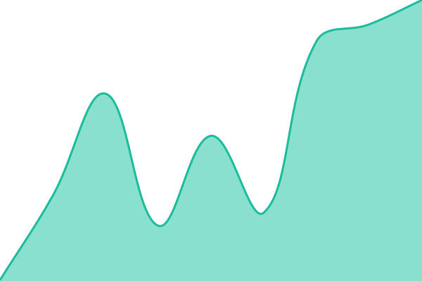
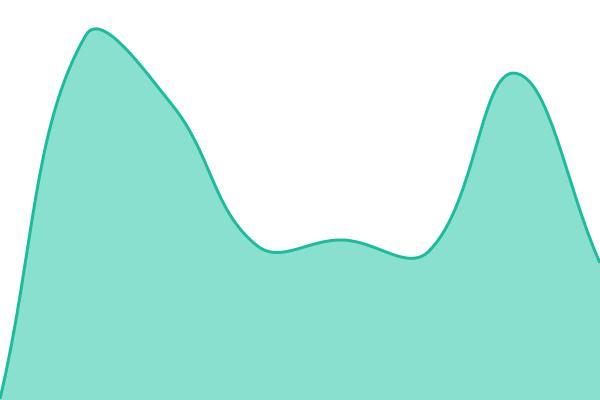

# [📈 Live Status](https://status.kuakua.cr): <!--live status--> **🟧 Partial outage**

This repository contains the open-source uptime monitor and status page for [Floristeria Kua'Kua](https://www.kuakua.cr), powered by [Upptime](https://github.com/upptime/upptime).

With [Upptime](https://upptime.js.org), you can get your own unlimited and free uptime monitor and status page, powered entirely by a GitHub repository. We use [Issues](https://github.com/kuakuacr/kuakua-status/issues) as incident reports, [Actions](https://github.com/kuakuacr/kuakua-status/actions) as uptime monitors, and [Pages](https://status.kuakua.cr) for the status page.

<!--start: status pages-->
<!-- This summary is generated by Upptime (https://github.com/upptime/upptime) -->
<!-- Do not edit this manually, your changes will be overwritten -->
<!-- prettier-ignore -->
| URL | Status | History | Response Time | Uptime |
| --- | ------ | ------- | ------------- | ------ |
|  [Sitio web](https://kuakua.art) | 🟥 Down | [sitio-web.yml](https://github.com/kuakuacr/kuakua-status/commits/HEAD/history/sitio-web.yml) | 

 171ms
     
 | 

<a href="https://status.kuakua.cr/history/sitio-web">89.66%</a>
    

|  [Pedidos por WhatsApp](https://chat.kuakua.cr) | 🟥 Down | [pedidos-por-whats-app.yml](https://github.com/kuakuacr/kuakua-status/commits/HEAD/history/pedidos-por-whats-app.yml) | 

 313ms
     
 | 

<a href="https://status.kuakua.cr/history/pedidos-por-whats-app">89.93%</a>
    

|  [Seguimiento de envíos](https://go.kuakua.cr) | 🟩 Up | [seguimiento-de-envios.yml](https://github.com/kuakuacr/kuakua-status/commits/HEAD/history/seguimiento-de-envios.yml) | 

 227ms
     
 | 

<a href="https://status.kuakua.cr/history/seguimiento-de-envios">100.00%</a>
    

|  [Tarjetas (Nota Floral)](https://tarjetas.kuakua.cr/n/) | 🟩 Up | [tarjetas-nota-floral.yml](https://github.com/kuakuacr/kuakua-status/commits/HEAD/history/tarjetas-nota-floral.yml) | 

 243ms
     
 | 

<a href="https://status.kuakua.cr/history/tarjetas-nota-floral">99.99%</a>
    

<!--end: status pages-->

[**Visit our status website →**](https://status.kuakua.cr)

## 📄 License

- Powered by: [Upptime](https://github.com/upptime/upptime)
- Code: [MIT](./LICENSE) © [Anand Chowdhary](https://anandchowdhary.com)
- Data in the `./history` directory: [Open Database License](https://opendatacommons.org/licenses/odbl/1-0/)
